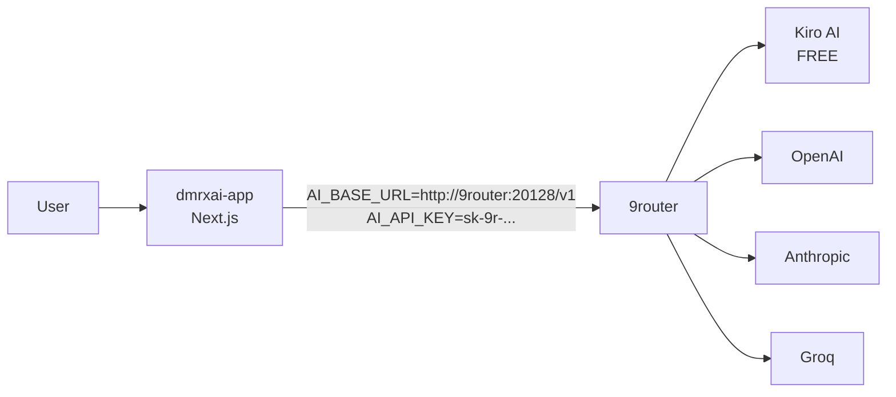

# 9Router Setup — Provider Configuration

> 📚 Bagian dari [`RUN.md`](./RUN.md). Baca itu dulu untuk konteks deployment.

Dokumen ini panduan setup 9Router setelah container running, sampai dmrxai siap melayani user.

## Tujuan

- Setup 9Router untuk handle multiple AI provider (FREE / cheap / paid)
- Generate API key 9Router yang stabil
- Inject key ke dmrxai supaya user pakai key milikmu (server-side hardcoded)

User dmrxai TIDAK perlu setup apapun. Semua key dan provider di-manage di 9Router oleh admin/owner.

## Apa itu 9Router?

9Router adalah AI router/proxy OpenAI-compatible:

- Auto-fallback antar provider (subscription → cheap → free)
- Token compression hemat 20-40%
- Multi-account round-robin per provider
- Web docs: https://9router.com
- Image Docker: `decolua/9router:latest` (listen port 20128)

## Arsitektur Integrasi



Kunci: **dmrxai TIDAK kenal cloud provider**. Hanya tahu 9Router. Semua complexity provider di-handle 9Router.

## Step 1: Buka Dashboard 9Router

URL: `https://9router.devplay.online`

- Auto-redirect ke `/login`
- Buat akun baru (email + password) atau login kalau sudah ada
- Setelah login → Dashboard

## Step 2: Connect Provider

1. Klik **Providers** atau **Connections** (UI bisa beda per versi)
2. Klik **Add Provider** atau **Connect**
3. Pilih dari kategori:
   - **FREE** (recommended untuk start, tanpa biaya):
     - **Kiro AI** — Claude unlimited, no signup
     - **OpenCode Free** — no auth
   - **CHEAP** (subscription model murah):
     - Provider dengan harga di bawah pasar
   - **PAID** (provider standar):
     - OpenAI (butuh API key dari platform.openai.com)
     - Anthropic (butuh API key dari console.anthropic.com)
     - Groq, Mistral, dll
4. Untuk paid, paste API key provider
5. Untuk free, ikuti OAuth flow kalau ada
6. Save → provider akan ke-list di status

## Step 3: Verify Models Tersedia

- Di dashboard, buka tab **Models**
- Harus terlihat list model dari provider yang barusan di-connect
- Contoh: `cc/claude-opus-4-7`, `cc/claude-sonnet-4-6`, dll

Kalau kosong, balik ke Step 2 dan cek status provider (mungkin OAuth gagal / API key invalid).

## Step 4: Generate API Key 9Router

1. Klik **API Keys** atau **Settings** (bagian generate key)
2. Klik **Create API Key**
3. Beri nama (mis. `dmrxai-production`)
4. Copy key yang di-generate, format: `sk-9r-xxxxxxxxxxxxxx`
5. JANGAN tutup tab sampai key ke-save di tempat aman

## Step 5: Inject Key ke dmrxai

Dari WSL2:

```bash
cd "/mnt/c/PRIVAT SERVER PROJECT WEB AUTO/Dmr x - Ai"
nano .env
```

Cari baris:

```
AI_API_KEY=
```

Isi dengan key dari Step 4:

```
AI_API_KEY=sk-9r-xxxxxxxxxxxxxx
```

Save (Ctrl+X, Y, Enter), lalu:

```bash
docker compose up -d app
```

Container `app` akan recreate dengan env baru.

## Step 6: Verify Integration

```bash
# Cek /api/config sekarang return aiConfigured=true
curl -s https://dmrxai.devplay.online/api/config
# Expected: {"aiConfigured":true,"usageConfigured":false,"aiBaseUrlHint":"http://9router:20128/v1"}
```

Buka `https://dmrxai.devplay.online` di browser:

- Klik Settings → harus tampil banner `🔒 Managed by server`
- Field API Key & Base URL HIDDEN
- Pilih model dari dropdown (auto-load dari `/v1/models` 9Router)
- Test chat dengan pertanyaan sederhana

## Multi-User Use Case

- User-user lain yang akses dmrxai pakai key milikmu otomatis
- Mereka tidak perlu setup apapun
- Billing dan usage di-track di 9Router dashboard
- Kamu bisa monitor consumption per provider di 9Router

## Provider Management

**Tambah provider baru**:

- Buka 9router dashboard → Providers → Add
- Tidak perlu restart container apapun (9Router pickup config baru live)

**Disable provider**:

- Toggle off di dashboard
- 9Router akan auto-fallback ke provider berikutnya

**Set fallback priority**:

- Drag-and-drop urutan provider di dashboard
- Atau set manual via API config (lihat 9router docs)

## Backup

Folder `9router-data/` punya:

- SQLite database (`db/data.sqlite`) — provider config + API keys
- Cache files

Backup berkala:

```bash
# Buat snapshot
cd "/mnt/c/PRIVAT SERVER PROJECT WEB AUTO/Dmr x - Ai"
tar czf 9router-backup-$(date +%Y%m%d).tar.gz 9router-data/
```

Pindahkan ke disk lain / cloud storage.

## Troubleshooting

**Dashboard 9Router 404**

- DNS belum ke-route. Run:
  ```bash
  cloudflared tunnel route dns 118d08ad-88c0-416e-9b53-fc32f3381f0a 9router.devplay.online
  ```
- Restart cloudflared: `docker compose restart cloudflared`

**9router restart loop**

- `cap_drop: ALL` hilangkan SETGID. Update compose:
  ```yaml
  cap_add: [CHOWN, SETUID, SETGID, DAC_OVERRIDE]
  ```

**Chat dmrxai error "fetch failed"**

- Cek 9router running: `docker compose ps`
- Cek key valid: dari dashboard 9Router, regenerate kalau perlu
- Cek connectivity:
  ```bash
  docker exec dmrxai-app wget -qO- http://9router:20128/v1/models
  ```

**Provider rate limit / unavailable**

- 9Router auto-fallback. Cek dashboard untuk lihat status per provider
- Connect provider tambahan untuk redundansi

**Provider config hilang setelah restart**

- `9router-data/` volume hilang. Pastikan di compose:
  ```yaml
  volumes:
    - ./9router-data:/app/data
  ```

## Security Notes

- API key 9Router HANYA di server-side env (`.env`), TIDAK di code/UI
- User dmrxai TIDAK bisa lihat / extract API key dari browser
- Tapi kalau dmrxai dashboard publik, siapa pun bisa habiskan saldo via chat
- **Aktifkan Cloudflare Access** untuk `dmrxai.devplay.online` (whitelist email) supaya hanya user yang kamu undang
- Kalau key bocor: regenerate dari 9Router dashboard, update `.env`, lalu `docker compose up -d app`

## Reference

- 9Router GitHub: https://github.com/decolua/9router
- 9Router npm: https://www.npmjs.com/package/9router
- dmrxai Settings UI: https://dmrxai.devplay.online (klik gear icon)
- vps-dashboard tunnel listing: https://server-dmr.devplay.online (cek halaman Tunnels)
