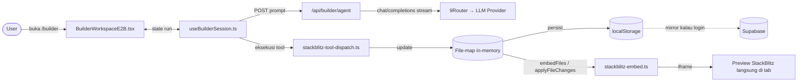
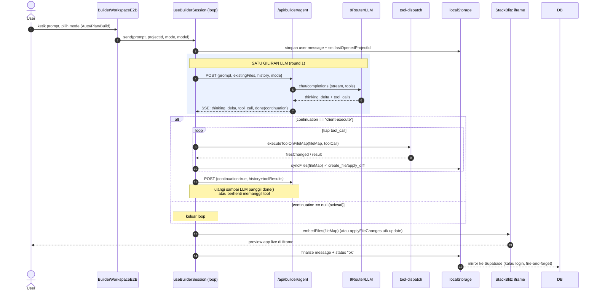
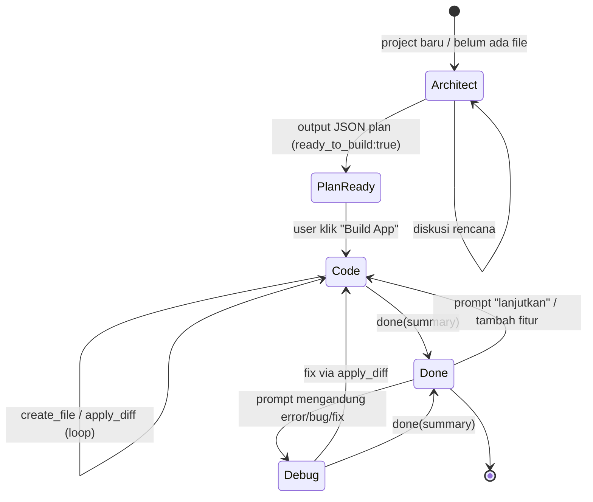
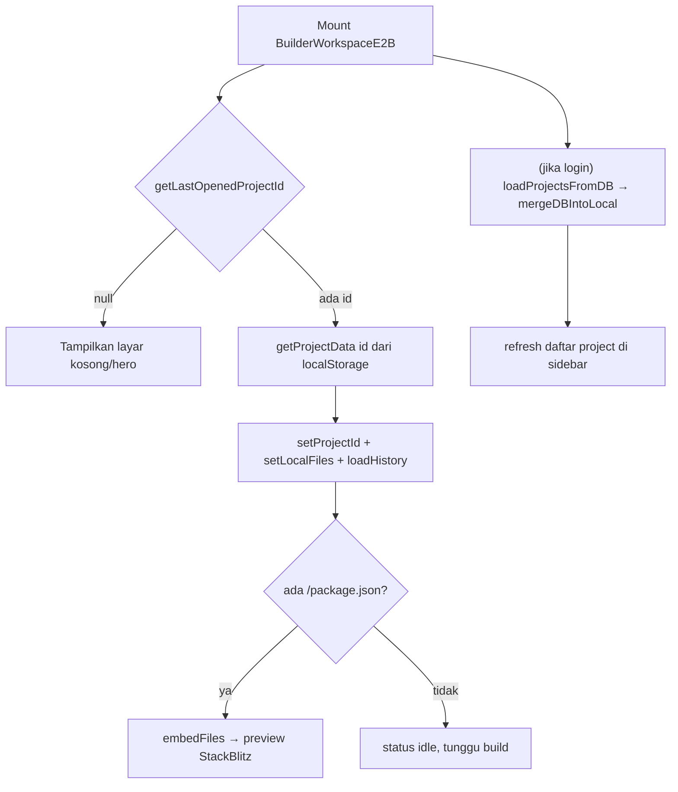

# Dmr x AI — Dokumentasi Program & App Builder

Dokumen ini menjelaskan keseluruhan program **Dmr x AI** dengan fokus utama
pada fitur **AI App Builder**. Berisi: arsitektur, skema database (ERD),
dan diagram flow cara kerjanya.

> Diagram memakai sintaks **Mermaid**. GitHub, VS Code (dengan ekstensi
> Mermaid), dan banyak viewer markdown me-render-nya otomatis.

---

## 1. Gambaran Umum Program

Dmr x AI adalah platform AI multi-fitur berbasis **Next.js 14 (App Router)** +
**TypeScript** + **Tailwind**, dengan **Supabase** untuk auth & penyimpanan, dan
**9Router** sebagai proxy multi-provider LLM.

Fitur utama:

| Fitur | Route | Ringkasan |
|---|---|---|
| **Chat** | `/chat` | Chat multi-model, thinking/deep-research, tool calling (web search, fetch URL, render chart) |
| **App Builder** | `/builder` | Generate aplikasi React lengkap dari prompt, live preview via StackBlitz |
| **Image Gen** | `/` (image mode) | Text-to-image |
| **Auth** | `/login`, `/signup`, `/auth/*` | Supabase Auth (email + OAuth callback) |
| **Models** | `/models` | Katalog model dari 9Router |

### Stack

| Layer | Tools |
|---|---|
| Framework | Next.js 14 App Router |
| Bahasa | TypeScript (strict) |
| UI | Tailwind CSS, lucide-react, prism-react-renderer |
| Auth & DB | Supabase (Postgres + RLS + Auth) |
| LLM Router | 9Router (proxy multi-provider, OpenAI-compatible) |
| App Builder engine | **StackBlitz SDK** (`@stackblitz/sdk`) |
| Web search | SearXNG |
| Deploy | Docker Compose + Cloudflare Tunnel |

### Peta direktori (ringkas)

```
app/
├── api/
│   ├── chat/                  # endpoint chat streaming
│   ├── builder/
│   │   ├── agent/route.ts     # ★ otak App Builder (single-turn LLM, SSE)
│   │   └── projects/          # CRUD project (GET/POST + [id] GET/DELETE)
│   ├── models/ search/ image/ usage/ fetch-url/ config/
├── builder/                   # halaman /builder
│   ├── page.tsx               # dynamic import BuilderWorkspaceE2B (ssr:false)
│   └── layout.tsx
├── components/
│   └── BuilderWorkspaceE2B.tsx # ★ UI App Builder (chat + code + preview)
├── hooks/
│   └── useBuilderSession.ts   # ★ loop agent sisi-klien + dispatch tool
└── lib/
    ├── agent-tools.ts         # definisi tool + system prompt + mode
    ├── stackblitz-embed.ts    # ★ embed project ke iframe StackBlitz
    ├── stackblitz-tool-dispatch.ts # ★ eksekusi tool atas file-map in-memory
    ├── builder-storage.ts     # localStorage (source of truth) + mirror DB
    └── supabase-projects.ts   # akses DB project (server-side)
supabase/migrations/           # skema database (001, 002)
```

---

## 2. Fitur App Builder — Cara Kerja

### Konsep inti

App Builder memakai **StackBlitz SDK** sebagai satu-satunya engine. Tidak ada
sandbox server-side — StackBlitz menjalankan project di iframe browser
(WebContainers milik StackBlitz), meng-install dependency otomatis dari
`package.json`, dan menjalankan dev server-nya. **Iframe StackBlitz itulah
preview-nya.**

Pembagian peran:

- **Server** (`/api/builder/agent`): stateless, **satu giliran LLM per
  request**. Stream reasoning, emit tool call, lalu kirim event `done`.
- **Klien** (`useBuilderSession`): yang **memegang loop**. Mengeksekusi tiap
  tool call terhadap **file-map in-memory**, simpan ke localStorage, lalu
  re-POST history untuk lanjut sampai LLM berhenti memanggil tool.
- **Preview** (`stackblitz-embed`): mount file-map ke iframe StackBlitz; update
  berikutnya dikirim via diff (`applyFileChanges`).

### Tool yang bisa dipanggil AI

Didefinisikan di `app/lib/agent-tools.ts` (`BUILDER_TOOLS`):

| Tool | Argumen | Fungsi |
|---|---|---|
| `create_file` | `path`, `content` | Buat/timpa file |
| `apply_diff` | `path`, `diff` | Edit file via blok SEARCH/REPLACE |
| `delete_file` | `path` | Hapus file |
| `read_file` | `path` | Baca file (cap 10K char) |
| `list_files` | `directory?` | List file |
| `done` | `summary` | Tandai build selesai |

> **Tidak ada `run_command`** — StackBlitz tidak punya shell. Dependency
> dideklarasikan di `package.json`, StackBlitz install otomatis.

### Mode agent

Ditentukan eksplisit oleh user (picker Auto/Plan/Build) atau auto-detect
(`detectMode`):

| Mode | Kapan | Perilaku |
|---|---|---|
| **architect** (Plan) | Project baru / belum ada file | Diskusi rencana, output JSON plan dengan `ready_to_build:true` → muncul tombol **Build App**. Tidak menyentuh file. |
| **code** (Build) | Ada plan / project existing | Eksekusi: hanya tool call sampai `done()`. Text-only dilarang. |
| **debug** | Prompt mengandung kata error/bug/fix | Baca file → cari root cause → `apply_diff`. |

### Penyimpanan (dua lapis)

- **localStorage** = source of truth untuk UI instan (`builder-storage.ts`).
  Key: `dmrxai:builder:projects`, `dmrxai:builder:lastOpenedProjectId`.
- **Supabase** = mirror durable lintas device (kalau user login). Sinkron
  fire-and-forget; kegagalan DB non-fatal karena localStorage tetap jalan.

---

## 3. ERD (Entity Relationship Diagram)

Skema sebenarnya dari `supabase/migrations/`. Tabel inti App Builder:
`projects`, `project_files`, `project_messages`.

```mermaid
erDiagram
    auth_users ||--o| profiles : "1:1"
    auth_users ||--o| user_settings : "1:1"
    auth_users ||--o{ chat_conversations : "punya"
    chat_conversations ||--o{ chat_messages : "punya"
    auth_users ||--o{ image_generations : "punya"

    auth_users ||--o{ projects : "punya"
    projects ||--o{ project_files : "punya"
    projects ||--o{ project_messages : "punya"

    auth_users {
        uuid id PK
        text email
    }
    profiles {
        uuid id PK_FK
        text email
        text display_name
        text avatar_url
        timestamptz created_at
        timestamptz updated_at
    }
    user_settings {
        uuid user_id PK_FK
        text model
        real temperature
        int max_tokens
        text system_prompt
        text theme
        jsonb image_settings
        jsonb preferences
    }
    projects {
        uuid id PK
        uuid user_id FK
        text title
        text sandbox_id "vestigial (era E2B)"
        text sandbox_status "vestigial"
        text plan_markdown
        text template
        timestamptz created_at
        timestamptz updated_at
    }
    project_files {
        uuid id PK
        uuid project_id FK
        text path "UNIQUE(project_id, path)"
        text content
        timestamptz updated_at
    }
    project_messages {
        uuid id PK
        uuid project_id FK
        text role "user|assistant|system"
        text content
        jsonb metadata "berisi tool_calls"
        timestamptz created_at
    }
    chat_conversations {
        uuid id PK
        uuid user_id FK
        text title
    }
    chat_messages {
        uuid id PK
        uuid conversation_id FK
        text role
        text content
        jsonb tool_calls
        jsonb attachments
    }
    image_generations {
        uuid id PK
        uuid user_id FK
        text prompt
        text image_url
    }
```

### Catatan ERD

- Semua tabel pakai **RLS** (Row Level Security). Project & turunannya difilter
  `user_id = auth.uid()`; `project_files`/`project_messages` diverifikasi lewat
  kepemilikan project induknya.
- Kolom `sandbox_id`, `sandbox_status`, `template` di `projects` adalah
  **vestigial** (peninggalan engine E2B lama). Setelah migrasi ke StackBlitz,
  kolom ini tidak dipakai lagi tapi dibiarkan agar tidak perlu migrasi destruktif.
- Trigger `on_auth_user_created` otomatis membuat `profiles` + `user_settings`
  saat user signup.

---

## 4. Flow — Arsitektur Tingkat Tinggi



---

## 5. Flow — Sequence Build Lengkap

Dari prompt user sampai preview live, termasuk loop continuation.



---

## 6. Flow — State Mode (Plan → Build → Debug)



> Guard penting di mode **code/debug**: kalau LLM balas teks tanpa tool call,
> hook inject reminder dan ulangi (maks 3×) agar build tidak "mengulang janji
> kosong" tanpa membuat file.

---

## 7. Flow — Restore Saat Refresh

Bagaimana chat & file dipulihkan setelah reload halaman `/builder`.



> Pointer `lastOpenedProjectId` di-set saat: buat project (prompt pertama),
> "New Project", dan pilih project dari sidebar — sehingga refresh selalu
> memulihkan workspace terakhir.

---

## 8. Event SSE dari `/api/builder/agent`

Kontrak event yang dikirim server ke klien:

| Event | Payload | Arti |
|---|---|---|
| `status` | `{phase, message}` | Update fase (mode, thinking, executing, dll) |
| `thinking_delta` | `{text}` | Token reasoning (efek mengetik) |
| `tool_call` | `{id, name, args}` | LLM memanggil tool (untuk activity feed) |
| `done` | `{summary, continuation, assistant_message, mode}` | Akhir giliran. `continuation`: `"client-execute"` (klien eksekusi tool lalu lanjut) atau `null` (selesai) |
| `error` | `{error}` | Error fatal |

---

## 9. Catatan & Batasan

- **Hanya JS/TS + npm** — StackBlitz tidak mendukung native binary
  (sharp, sqlite3, dll).
- **Project StackBlitz baru hidup di memori browser** kecuali user fork-nya;
  source of truth tetap di localStorage (di-mirror ke Supabase).
- **Tidak butuh header COOP/COEP** — StackBlitz jalan di origin iframe-nya
  sendiri (berbeda dengan engine WebContainer API lama).
- Project wajib **Vite + React + TypeScript** dengan `package.json` (punya
  script `dev`), `index.html`, `src/main.tsx`, dan `src/App.tsx`.

---

## 10. Referensi File Kunci

| Peran | File |
|---|---|
| Server agent (SSE, single-turn) | `app/api/builder/agent/route.ts` |
| Loop agent sisi-klien | `app/hooks/useBuilderSession.ts` |
| Dispatcher tool (pure) | `app/lib/stackblitz-tool-dispatch.ts` |
| Embed StackBlitz | `app/lib/stackblitz-embed.ts` |
| Definisi tool + prompt + mode | `app/lib/agent-tools.ts` |
| Storage localStorage + mirror DB | `app/lib/builder-storage.ts` |
| Akses DB project (server) | `app/lib/supabase-projects.ts` |
| UI workspace | `app/components/BuilderWorkspaceE2B.tsx` |
| CRUD project API | `app/api/builder/projects/route.ts`, `app/api/builder/projects/[id]/route.ts` |
| Skema DB | `supabase/migrations/001_builder_tables.sql`, `002_auth_and_user_data.sql` |
| Doc engine | `docs/builder-engines.md` |
